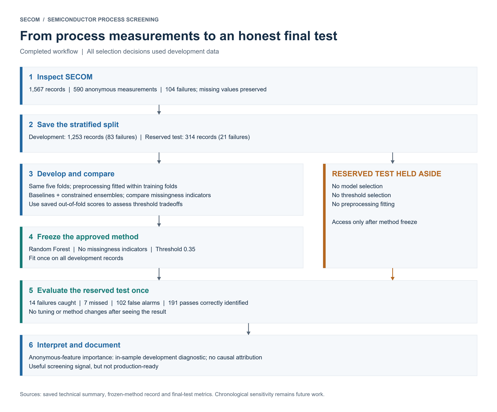
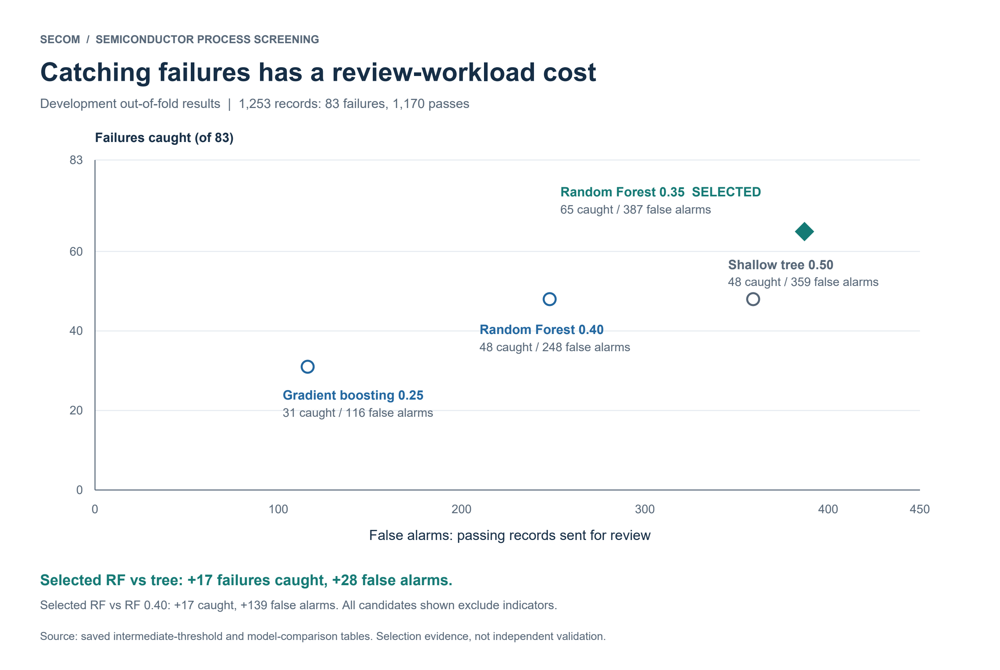
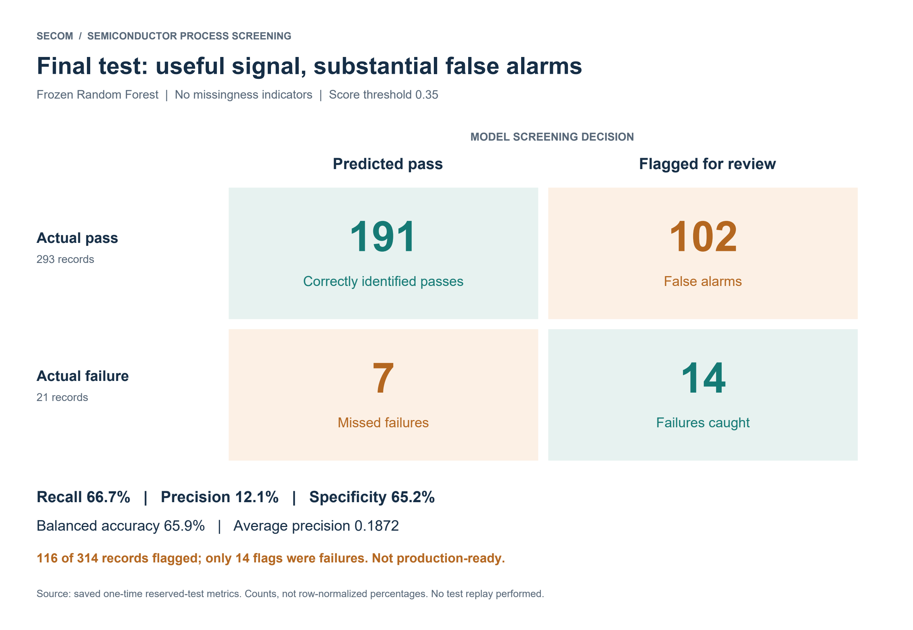
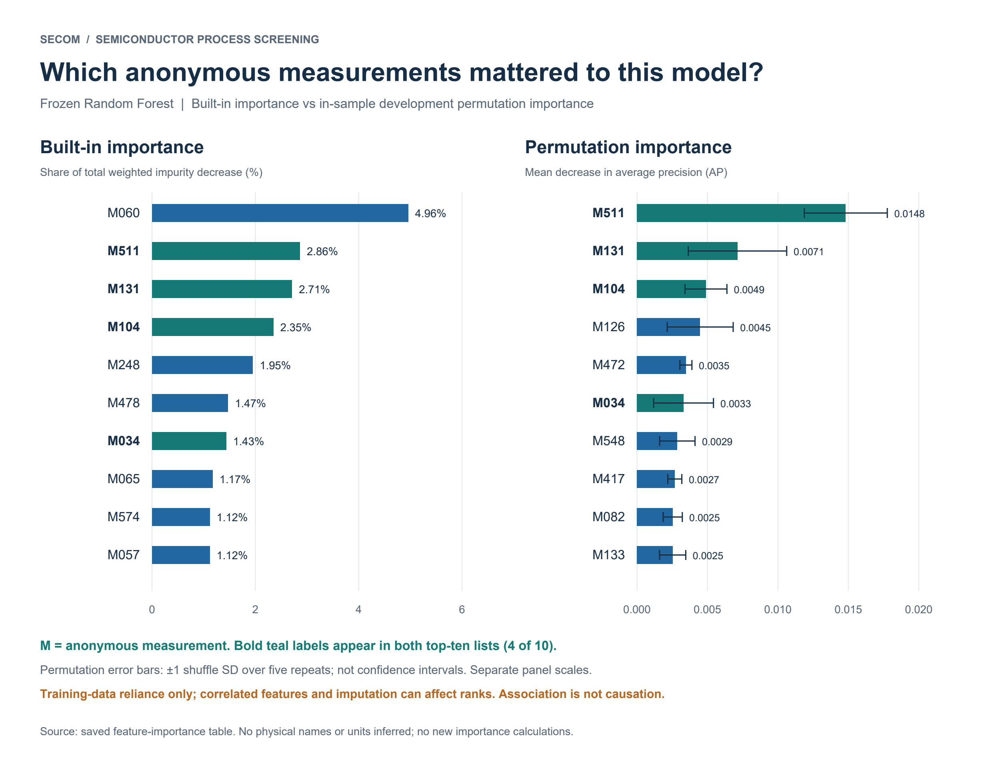

# Semiconductor Process Variation and Yield Analysis

## Project overview

**Can anonymous process measurements help prioritize semiconductor production records for additional quality review?**

This engineering portfolio project uses SECOM manufacturing data to investigate measurement variation and associations with failed quality tests. It combines careful missing-data handling, leakage prevention, rare-failure evaluation, and an explicit decision about false alarms versus missed failures.

**Tools:** Python, NumPy, pandas, SciPy, scikit-learn, and standard-library unit testing.

**Final result:** a frozen Random Forest without missingness indicators, using a score threshold of **0.35**, caught **14 of 21 failures** on a once-used reserved test set. It missed **7 failures** and generated **102 false alarms**.

| Reserved-test metric | Result |
|---|---:|
| Failure recall | **66.7%** |
| Precision | **12.1%** |
| Specificity | **65.2%** |
| Balanced accuracy | **65.9%** |
| Average precision | **0.1872** |

**The model demonstrates useful screening signal but is not production-ready because of false alarms and missed failures.** The project demonstrates engineering judgment about validation and review workload; it does not demonstrate improved manufacturing yield or physical root-cause discovery.

## Engineering objective

Assess whether unusual behavior in anonymous process measurements is associated with failed quality tests, and evaluate whether a constrained machine-learning model can prioritize records for further review. A flag means “review this record,” not “a defect is confirmed” or “scrap this product.”

## Why semiconductor screening matters

A screening decision has two competing consequences: a missed failure can escape additional review, while a false alarm consumes review capacity. This project makes that tradeoff visible through failure counts and review workload, rather than relying on overall accuracy in a dataset where failures are rare. Actual factory costs and review capacity were not available, so the chosen operating point is a portfolio engineering decision, not a proven economic optimum.

## Dataset summary

| Item | Observed structure |
|---|---|
| Source | UCI SECOM |
| Records | 1,567 |
| Anonymous measurement columns | 590 |
| Outcomes | 104 failures; 1,463 passes |
| Failure prevalence | Approximately 6.6% |
| Missing measurement cells | Approximately 4.54%; every record has missing values |
| Development partition | 1,253 records: 83 failures, 1,170 passes |
| Reserved-test partition | 314 records: 21 failures, 293 passes |

Direct file inspection confirmed **590 measurement columns**, resolving the documentation discrepancy through observed structure. Labels and timestamps are stored separately. No physical names or units are inferred for the anonymous features.

Timestamps represent quality-test times, not confirmed measurement acquisition times. They were preserved as metadata but did not drive the primary split or enter the model. A chronological sensitivity analysis remains future work.

## Workflow

1. Inspect raw-file structure, labels, missingness, and source documentation.
2. Save a fixed, shuffled, stratified development/test split and five development folds.
3. Implement and verify training-only preprocessing.
4. Compare simple baselines and a small fixed set of stronger models.
5. Reuse out-of-fold development predictions to assess threshold tradeoffs.
6. Freeze the selected method, fit on the full development set, and evaluate the reserved test once.
7. Interpret the frozen model conservatively and document the engineering limitations.



## Preprocessing and leakage prevention

- Original raw files and saved row/fold assignments were preserved. Failure is the positive class.
- Median imputation and constant-observed/all-missing filtering were fitted only on each training fold, then applied unchanged to its validation fold.
- Logistic regression used training-only numeric scaling; tree models did not require scaling.
- Missingness indicators were compared explicitly rather than assumed useful. The frozen model excludes them.
- Incomplete records were retained. Validation and test sets kept their natural class proportions; no synthetic oversampling was used.
- Row identifiers and timestamps were excluded from predictive inputs. Class weights were derived from training outcomes only.
- All model and threshold decisions used development data. The complete method was frozen before reserved-test evaluation, with no subsequent tuning.

The full-development preprocessing fit retained **468 numeric inputs**. Observed-value distribution summaries excluded missing observations rather than treating imputed values as measurements.

## Models compared

All configurations used the same five stratified development folds. Models were compared with and without missingness indicators, using fixed settings rather than broad hyperparameter searches.

| Model | Mean validation average precision, without indicators |
|---|---:|
| Prevalence reference | 0.0662 |
| Logistic regression, C = 1 | 0.1294 |
| Shallow decision tree | 0.1072 |
| Stronger-regularized logistic regression, C = 0.1 | 0.1290 |
| Random Forest | 0.1987 |
| Shallow histogram gradient boosting | 0.2216 |

Average precision measures failure-ranking performance across thresholds. Boosting had the highest observed mean average precision, but ranking quality alone did not determine the preferred screening workload. At threshold 0.50, the stronger ensembles caught fewer failures than the shallow tree while generating fewer false alarms.

Average precision is reported as the mean across validation folds. Threshold-based development rates use pooled out-of-fold decisions, with each record contributing once. Development comparisons informed selection and are not independent final estimates. See the [complete model comparison](reports/comparisons/secom-stronger-model-comparison.md).

## Threshold-selection reasoning

Threshold comparisons reused saved out-of-fold scores without retraining. The final decision compared these development operating points:

| Candidate | Failures caught | Failures missed | False alarms | Total reviews |
|---|---:|---:|---:|---:|
| Shallow tree at 0.50 | 48 | 35 | 359 | 407 |
| Random Forest without indicators at 0.40 | 48 | 35 | 248 | 296 |
| **Random Forest without indicators at 0.35** | **65** | **18** | **387** | **452** |

The selected 0.35 threshold caught **17 more failures than the shallow tree for 28 additional false alarms**. Compared with the forest at 0.40, it caught **17 additional failures for 139 additional false alarms**. The higher-detection tradeoff was explicitly approved before the final test.

At 0.35, adding missingness indicators caught the same 65 failures but increased false alarms from 387 to 418. Excluding indicators was supported at this operating point; it does not mean indicators are universally unhelpful.

Scores from class-weighted models are not established as calibrated probabilities. A score of 0.35 should not be interpreted as a verified 35% probability of failure.



## Frozen Random Forest configuration

| Setting | Frozen value |
|---|---|
| Trees | 100 |
| Maximum depth | 5 |
| Minimum samples per leaf | 10 |
| Features considered per split | Square root of input count |
| Class weights | Balanced |
| Bootstrap sampling | Enabled |
| Random seed | 42 |
| Numeric preprocessing | Development-derived filtering and median imputation; no scaling |
| Missingness indicators | Excluded |
| Screening rule | Flag when failure score is at least 0.35 |

Complete settings and historical provenance are preserved in [the frozen-method record](config/frozen_method.json). No feature-importance-based selection was applied.

## Reserved-test results

The frozen pipeline was fitted once on all development records and evaluated once on **314 reserved records**, including **21 failures**.

| Metric | Development validation | Reserved test |
|---|---:|---:|
| Failure recall | 78.3% | **66.7%** |
| Precision | 14.4% | **12.1%** |
| Specificity | 66.9% | **65.2%** |
| Balanced accuracy | 72.6% | **65.9%** |
| Average precision | 0.1987 | **0.1872** |

The model caught **14 failures**, missed **7 failures**, produced **102 false alarms**, and correctly identified **191 passes**. It sent **116 records for review**, of which only 14 were actual failures.

Performance degraded relative to development validation, especially recall and balanced accuracy. Ranking performance remained relatively similar. Development average precision is a five-fold mean; test average precision is calculated across the reserved set. Raw counts across differently sized partitions should not be used to infer improvement.

See the [final-test report](reports/final_evaluation/secom-final-test-evaluation.md). The test set has now been used and must not become a tuning set.

## Confusion matrix

Rows are actual quality-test outcomes; columns are model screening decisions.

| Actual outcome | Predicted pass | Flagged for failure review |
|---|---:|---:|
| Pass | **191** correctly identified passes | **102** false alarms |
| Failure | **7** missed failures | **14** failures caught |



## Feature-interpretation summary



Built-in importance and permutation importance both highlighted anonymous measurements **511, 131, and 104**. Measurement 511 ranked first by permutation importance and second by built-in importance. Its observed development median was higher for failures, although pass/fail distributions overlapped substantially.

Agreement between methods was limited: only **6 of the top 20 features** overlapped. Measurement 060 ranked first by built-in importance, yet shuffling it slightly improved development average precision. Correlated measurements, missingness, distribution tails, and shuffle variability complicate individual-feature interpretation.

**Permutation importance was an in-sample diagnostic.** The final model had been fitted on all development records, and fitted cross-validation estimators were unavailable. Five shuffles measured reliance by this fitted model, not independent predictive importance or population-level stability. The reserved test was not used for this analysis.

These findings describe **predictive association, not physical root cause**. See the [feature-interpretation report](reports/feature_interpretation/secom-frozen-feature-interpretation.md) for ranked features, missingness rates, observed distributions, and limitations.

## Engineering conclusions

The model demonstrated useful screening signal: it detected two-thirds of reserved-test failures. However, most alerts were passing records, and one-third of failures were missed. **It is not production-ready.**

The main engineering contribution is a transparent evaluation of detection versus review workload, supported by leakage-controlled preprocessing, preserved validation assignments, a frozen decision rule, and a one-time final test. No manufacturing yield improvement, cost saving, or deployable process-control capability was established.

## Limitations

- Only 21 reserved-test failures make recall estimates uncertain; individual outcomes have substantial influence.
- Anonymous features and unknown acquisition timing limit physical interpretation and assessment of prospective feature availability.
- Missing production identifiers prevent firm conclusions about independence across lots, tools, or related records.
- Development results reflect model and threshold selection; they may be optimistic.
- Temporal drift and chronological robustness have not been evaluated.
- Scores are uncalibrated, and actual review capacity and failure costs are unknown.
- In-sample feature importance can reflect overfitting, correlated inputs, and imputation patterns; it does not establish causal mechanisms.

## Repository structure

```text
.
├── README.md
├── requirements.txt
├── requirements-figures.txt   # Optional figure-rendering dependencies
├── LICENSE                    # MIT license for project code
├── preprocessing.py          # Historical model-import compatibility
├── config/                   # Frozen settings, paths, provenance
├── data/
│   ├── README.md             # Source and download instructions
│   ├── raw/                  # Local only; excluded from Git
│   └── splits/               # Saved partitions and development folds
├── notebooks/                # Cleaned inspection notebook
├── src/
│   ├── preprocessing.py
│   ├── paths.py
│   ├── integrity.py
│   ├── inspection/
│   ├── modeling/
│   ├── evaluation/
│   └── interpretation/
├── reports/                  # Summaries, methods, comparisons, validated results
├── figures/                  # Four PNG/SVG figures, renderer, and source provenance
├── tests/                    # Synthetic preprocessing and portability tests
└── artifacts/                # Local model/predictions/caches; excluded from Git
```

## How to inspect/run the project

Start with the [technical summary](reports/summaries/technical-engineering-summary.md), [short recruiter summary](reports/summaries/recruiter-summary.md), and saved reports. These can be reviewed without installing packages or accessing raw data.

The verified working environment used **Python 3.12.14**. For an independent setup, create and activate a virtual environment, then attempt installation of the recorded pins:

```text
python -m venv .venv
# Activate .venv using the command appropriate for your shell.
python -m pip install -r requirements.txt
```

**Fresh installation is not yet verified.** Do not silently substitute package versions if installation fails.

From the repository root, these checks do not fit predictive models or evaluate the reserved test:

```text
python -B -m unittest discover -s tests -t . -v
python -B -m src.inspection.save_evidence
```

The second command checks the archived notebook structure without executing its cells. Synthetic tests need no raw dataset. For data-dependent work, follow [data/README.md](data/README.md) and place the source files in `data/raw/`. Preserve the saved split/fold manifests.

Use package-module entry points, not direct execution of nested script paths. Historical comparison commands retain repeat-run guards; final-test replay is explicitly disabled. Missing local model/prediction artifacts must not trigger automatic retraining.


### Optional figure rendering

The four PNG/SVG figure pairs are already included; viewing them needs no Python packages. To regenerate them from saved aggregate results, install the separate optional dependencies and run:

```text
python -m pip install -r requirements-figures.txt
python figures/render_figures.py
```

ReportLab 4.4.9 and pypdfium2 5.13.0 were the rendering versions used. Pillow is required for PNG export and is pinned in the optional file. These packages are not part of the core scientific/runtime requirements. Figure rendering does not retrain models or evaluate test records. Fresh installation of either dependency file remains unverified.

## Reproducibility status

- **Verified in the working environment:** all 16 source modules imported; 13 preprocessing/portability tests passed.
- **Evidence preserved:** 59 copied non-code/non-notebook scientific evidence files matched their recorded hashes after migration.
- **Notebook reviewed:** paths were made portable, outputs and execution metadata cleared, and code parsed without rerunning inspection.
- **Fresh environment incomplete:** a new virtual environment was created, but offline installation failed because no matching NumPy 2.5.3 package was available to that install. Online package availability, clean installation, and cross-platform reproduction remain unverified.
- **Public artifact boundary:** generated fitted models, record-level predictions, and permutation caches are excluded from the initial public repository. A clone can inspect results and run synthetic tests, but artifact-dependent replay requires the exact omitted local artifacts.

See [the reproducibility record](reports/methodology/reproducibility.md) for verified scope, commands, and remaining blockers. This repository is not presented as a fully verified end-to-end clean-install reproduction package.

## Data source/attribution

Michael McCann and Adrian Johnston (2008), **SECOM**, UCI Machine Learning Repository. Dataset DOI: [10.24432/C54305](https://doi.org/10.24432/C54305). The project source records identify the dataset license as **CC BY 4.0**; retain attribution when reusing the data. Project code is licensed under the [MIT License](LICENSE). SECOM data and dataset-derived content retain their separate CC BY 4.0 attribution; the MIT license does not replace the dataset license.

Download instructions and source-file checksum references are in [data/README.md](data/README.md). Raw local data are excluded from Git.

## Future work

These items are proposed, not completed results:

- Verify an independent installation using the exact recorded dependencies.
- Decide how reproducibility artifacts should be distributed.
- Conduct a separately scoped chronological sensitivity analysis on development data, acknowledging quality-test timestamp limitations.
- Assess feature-importance stability using an appropriate held-out development workflow in a future study.
- Establish review-capacity and missed-failure costs with manufacturing stakeholders.
- Obtain documented measurements, production-group identifiers, and new prospective data before considering operational validation.

Any future method changes require a new validation plan and fresh independent evaluation data. The existing reserved test must not be reused for tuning.
